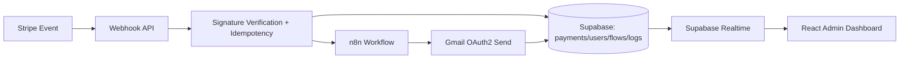
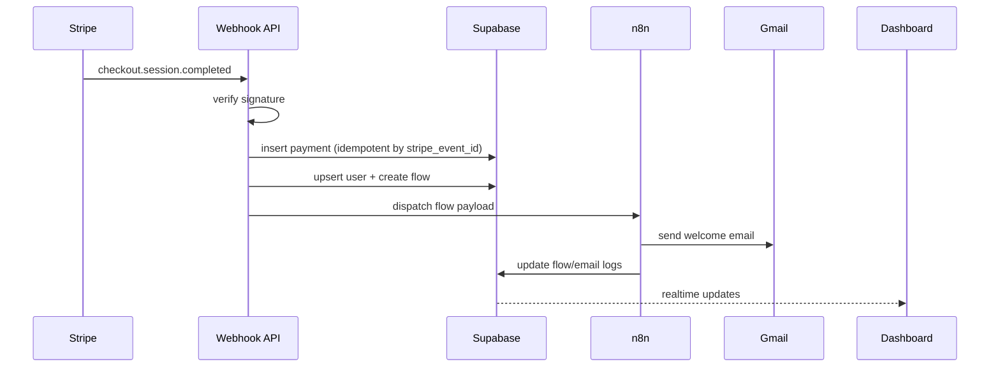

# Profit-Leak SKU Audit Dashboard

## 1) Project Architecture
- Frontend: React + Vite + Tailwind + React Query + Zustand + Recharts.
- Backend: Supabase (Postgres, Auth, RLS, Realtime).
- Automation: Existing n8n workflow invoked through webhook.
- Data flow: UI trigger -> n8n webhook -> n8n writes/returns -> Supabase tables -> realtime UI refresh.

## 2) Folder Structure
```text
src/
├── api/
├── components/
├── hooks/
├── layouts/
├── pages/
├── routes/
├── services/
├── store/
├── utils/
├── lib/
└── styles/
```

## 3) Supabase SQL Schema
- Use `supabase/schema.sql`.
- Includes `audit_reports`, `dead_skus`, `workflow_logs`, `integrations`, `settings`.
- Includes indexes, FKs, RLS policies, and realtime publication.

## 4) Environment Variables
Create `.env` from `.env.example`.

## 5) React Setup
```bash
npm install
npm run dev
```

## 6) Supabase Setup
1. Create a Supabase project.
2. Run SQL from `supabase/schema.sql`.
3. Enable email/password auth in Supabase Auth.

## 7) API Service Layer
- `src/api/http.ts`: shared Axios instance.
- `src/api/n8nApi.ts`: webhook trigger.
- `src/services/reportService.ts`: Supabase CRUD and log writes.

## 8) Dashboard Pages
- Login
- Dashboard overview
- SKU reports
- Dead SKU table
- Workflow logs
- Integrations
- Settings

## 9) Components
- Sidebar, top bar, reusable cards, chart modules.

## 10) Hooks
- `useReports`, `useDeadSkus`, `useWorkflowLogs`, `useTriggerAudit`.
- `useAuthSession` for auth guard.

## 11) Charts
- Total trapped capital trend.
- Top dead SKUs.
- Inventory distribution.

## 12) n8n Integration
The trigger button posts:
```json
{
  "source": "shopify",
  "days_without_sales": 90
}
```
to `VITE_N8N_WEBHOOK_URL`.

## 13) Deployment Guide
1. Deploy frontend to Vercel/Netlify.
2. Add production env vars.
3. Configure Supabase auth redirect URLs for deployed domain.
4. Ensure n8n webhook is reachable from public internet.

## 14) Security Best Practices
- Never expose Supabase service role key in frontend.
- Keep RLS enabled on all public tables.
- Limit webhook endpoint access (secret path or signature verification at n8n side).
- Add rate-limiting in n8n for trigger endpoint.
- Restrict CORS to trusted dashboard domains.
# Zero-Lag Onboarder (Gmail Version)

## 1) High-level architecture





- Scalable control-plane split: API handles trust boundary, n8n handles orchestration.
- Pluggable channels via `integrations` table and workflow branches (Slack/Twilio/WhatsApp/AI/CRM).
- Future-proofing with status-driven flow model (`onboarding_flows` + `onboarding_logs`).

## 2) Folder structure

```text
.
├── .env.example
├── README.md
├── backend
│   ├── package.json
│   └── src
│       ├── config.js
│       ├── routes
│       │   └── webhooks.js
│       ├── server.js
│       └── services
│           ├── gmail.js
│           └── supabase.js
├── frontend
│   ├── index.html
│   ├── package.json
│   ├── postcss.config.js
│   ├── tailwind.config.js
│   ├── vite.config.js
│   └── src
│       ├── App.jsx
│       ├── lib
│       │   ├── api.js
│       │   └── supabase.js
│       ├── main.jsx
│       ├── pages
│       │   ├── DataPage.jsx
│       │   └── OverviewPage.jsx
│       └── styles.css
├── n8n
│   └── workflows
│       └── zero-lag-onboarder.json
└── supabase
    └── schema.sql
```

## 3) Database schema

- Complete SQL is in `supabase/schema.sql`.
- Includes: `users`, `payments`, `onboarding_flows`, `onboarding_logs`, `email_logs`, `integrations`, `audit_logs`.
- Includes: enum status types, indexes, FK graph, timestamps, trigger-based `updated_at`.
- Includes: RLS enabled for all exposed tables with service-role policies and authenticated self-read policy for `users`.
- Includes: realtime publication additions for dashboard live updates.

## 4) Backend logic

- API entry: `backend/src/server.js`.
- Stripe webhook endpoint: `POST /webhooks/stripe` in `backend/src/routes/webhooks.js`.
- Security controls:
  - Stripe signature verification via `stripe.webhooks.constructEvent`.
  - Idempotency via unique `payments.stripe_event_id`.
  - Global rate limiting and hardened headers with Helmet.
- Business flow:
  - normalize Stripe event payload
  - upsert user in Supabase
  - persist payment record
  - create onboarding flow
  - write operational logs
  - trigger n8n via secret-protected webhook
- Error path writes to `audit_logs` for forensic traceability.

## 5) n8n workflow

- JSON export: `n8n/workflows/zero-lag-onboarder.json`
- Node-by-node:
  1. `Webhook Trigger`: receives onboarding payload from API.
  2. `Validate Secret`: compares request header with `N8N_ONBOARDING_SHARED_SECRET`.
  3. `Unauthorized Log`: writes denial log for invalid secret.
  4. `Mark In Progress`: updates flow status.
  5. `Send Gmail Welcome Email`: sends HTML onboarding email.
  6. `Persist Success`: writes `email_logs`, marks flow complete, appends `onboarding_logs`.
  7. `Webhook Response`: returns success to caller.
- Reusable extension pattern:
  - add branch nodes after `Mark In Progress` for Slack/Twilio/CRM.
  - standardize each step as `(send action) -> (persist status) -> (append log)`.

## 6) Gmail integration

- App-layer sender: `backend/src/services/gmail.js` with OAuth2 transport.
- Template architecture:
  - `renderWelcomeTemplate()` is reusable and supports dynamic variables (`name`).
  - n8n and backend can share subject/body contract.
- Delivery logging:
  - n8n `Persist Success` writes `email_logs`.
  - failures should route to error branch writing `email_logs.status='failed'` + retries.
- SMTP alternative:
  - swap transport to SMTP host (`smtp.gmail.com`, port 465/587) with app-password auth if OAuth is not available.

## 7) React dashboard

- Dashboard app in `frontend`.
- Pages covered:
  - Overview
  - Users
  - Payments
  - Workflow Logs
  - Email Logs
  - Integrations
  - Settings
- Features implemented:
  - Supabase realtime subscriptions
  - Search filter
  - Data panels and analytics cards
  - Responsive layout shell
- Architecture:
  - API/Supabase wrappers in `src/lib`
  - route-driven pages in `src/pages`
  - React Query for fetching/caching

## 8) Supabase setup

1. Create project in Supabase.
2. Run SQL from `supabase/schema.sql`.
3. Enable Auth providers for admin login (email/OAuth as required).
4. Add API keys to `.env`.
5. Confirm realtime is enabled for tables added in publication.

## 9) Deployment guide

### Docker Compose (recommended)

```yaml
services:
  api:
    build: ./backend
    env_file: .env
    ports: ["8080:8080"]
  frontend:
    build: ./frontend
    env_file: .env
    ports: ["5173:5173"]
  n8n:
    image: n8nio/n8n:latest
    env_file: .env
    ports: ["5678:5678"]
    volumes:
      - n8n_data:/home/node/.n8n
volumes:
  n8n_data:
```

### VPS + SSL + reverse proxy

1. Deploy API, frontend, and n8n services.
2. Use Nginx/Caddy for TLS termination with LetsEncrypt.
3. Route:
   - `api.yourdomain.com` -> backend
   - `app.yourdomain.com` -> frontend
   - `n8n.yourdomain.com` -> n8n
4. Register Stripe webhook endpoint to `https://api.yourdomain.com/webhooks/stripe`.
5. Import workflow JSON into n8n and set credentials/env.

### Vercel

- Deploy frontend on Vercel.
- Keep backend+n8n on VPS or container platform.
- Set `VITE_API_URL` to public API domain.

## 10) Security checklist

- [x] Stripe signature verification at ingress.
- [x] Idempotent payment ingestion by unique event ID.
- [x] Secrets loaded from environment; no secrets in source.
- [x] RLS enabled for all public tables.
- [x] Audit logs for processing failures.
- [x] Rate limit + Helmet at API boundary.
- [x] Shared-secret validation between API and n8n.
- [ ] Add RBAC table + claims mapping for multi-admin roles.
- [ ] Add WAF/IP allow-list for Stripe webhook source hardening.

## 11) Future scaling recommendations

- Multi-tenant SaaS:
  - add `tenant_id` to all business tables and extend RLS predicates.
  - partition `payments`/`logs` by month or tenant for high throughput.
- Event-driven growth:
  - place queue (SQS/Rabbit/Kafka) between webhook API and n8n for burst tolerance.
  - emit canonical domain events (`onboarding.started`, `email.sent`, `integration.failed`).
- Integration framework:
  - store provider configs in `integrations` with encrypted secrets.
  - expose provider adapters (`gmail`, `slack`, `twilio`, `crm`) behind one interface.
- AI onboarding:
  - add `agent_sessions` table and state machine transitions for LLM-driven onboarding assistants.
- Monitoring:
  - instrument API with OpenTelemetry + centralized logs.
  - define SLOs: webhook ingest latency, email send success rate, onboarding completion time.

## Run locally

```bash
# backend
cd backend
npm install
npm run dev

# frontend
cd ../frontend
npm install
npm run dev
```
